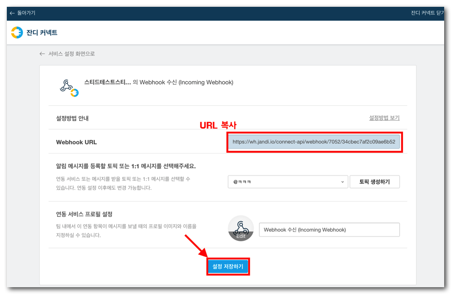
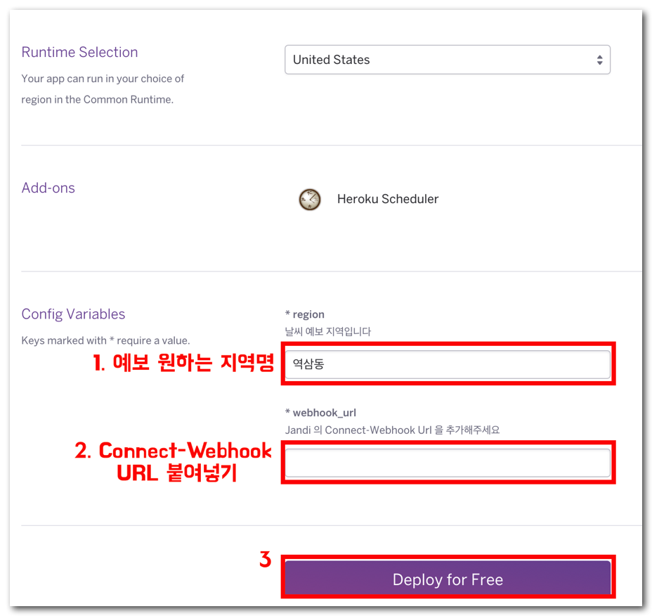
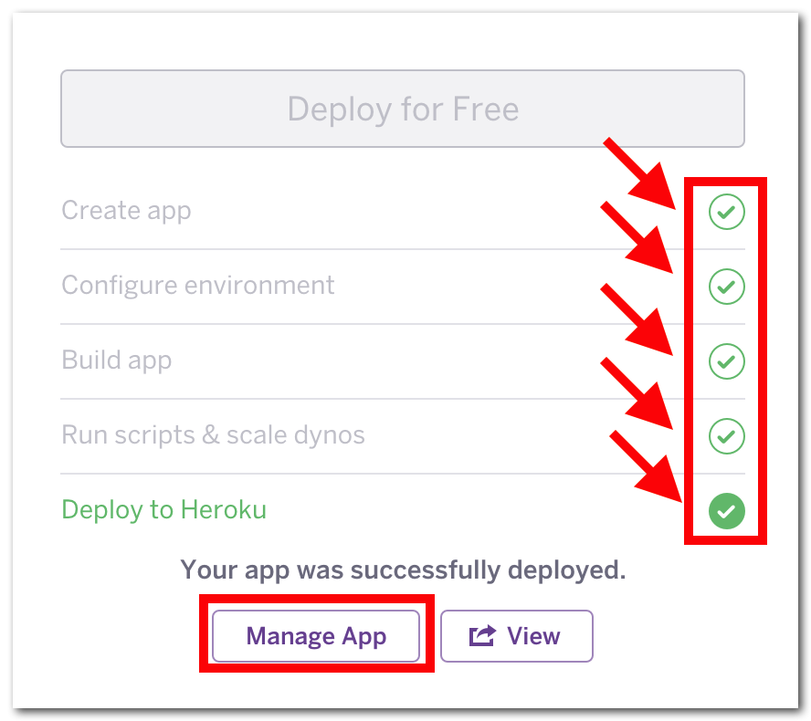

[](https://heroku.com/deploy)

How to install

1. add Connect - WebHook

* 잔디 커넥트 연동 설정 가기


* Webhook 수신 추가


* Webhook URL 복사 후 설정 저장


2. deploy to heroku

[](https://heroku.com/deploy) << Push!!!

* 지역명과 복사한 Webhook URL 붙여 넣기


* 배포가 완료되면 **Manage App** 선택


3. 일정 시간마다 날씨 예보 메세지 보여주도록 하기

* Resources > Heroku Scheduler


* Add New Job


```
jandiweather
```

주의!! 미국 시각 기준으로 실행되기 때문에 +9 를 해줘야 정확한 시간 계산을 하실 수 있습니다.